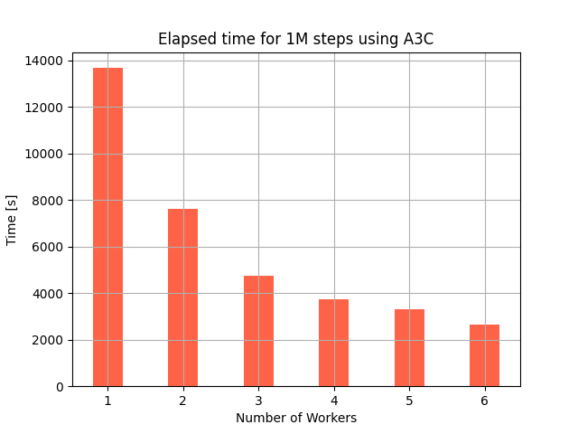
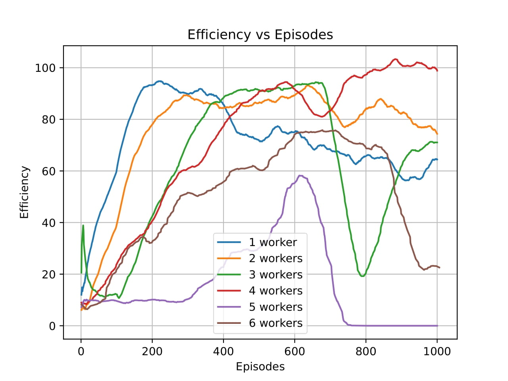
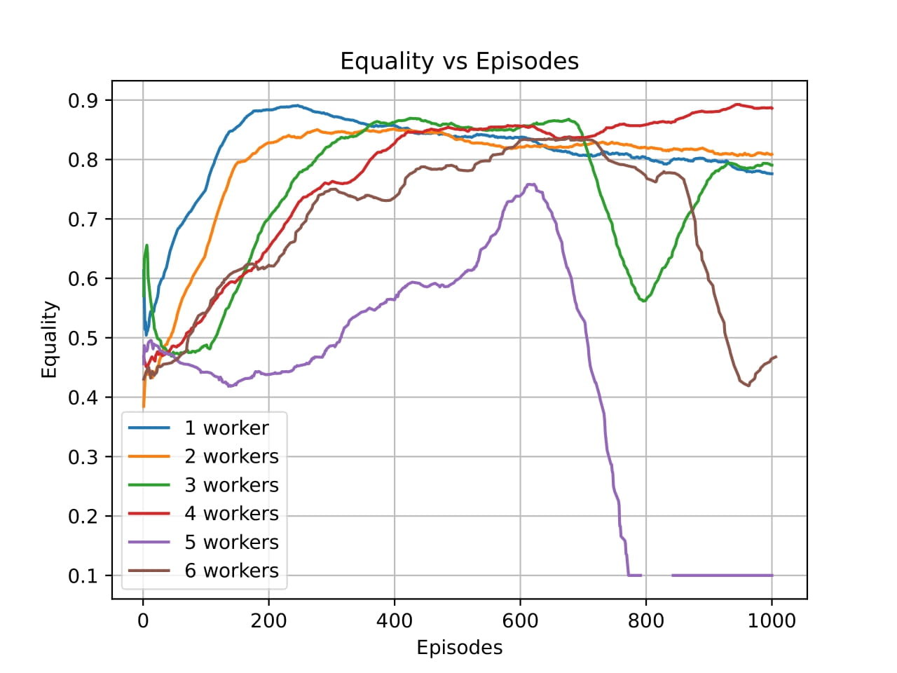
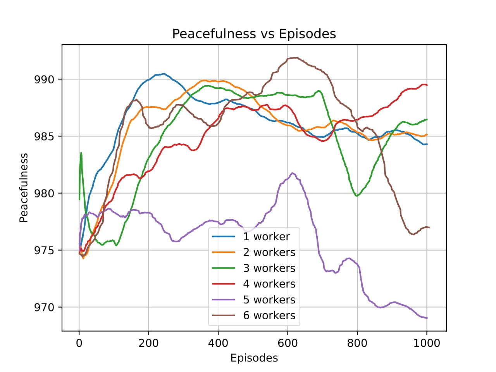
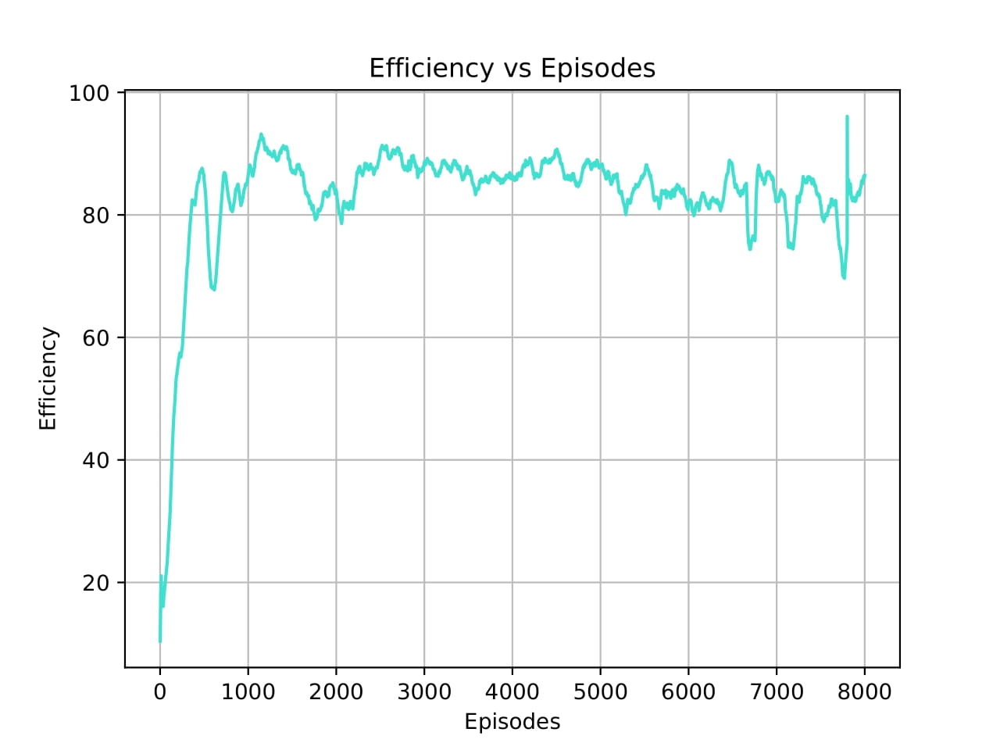
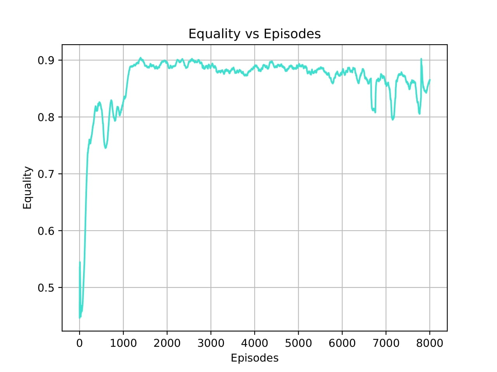
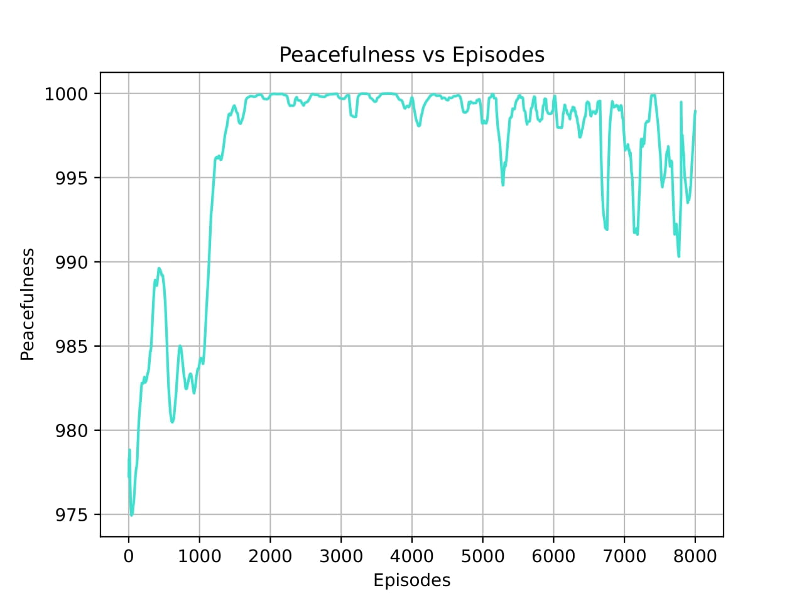
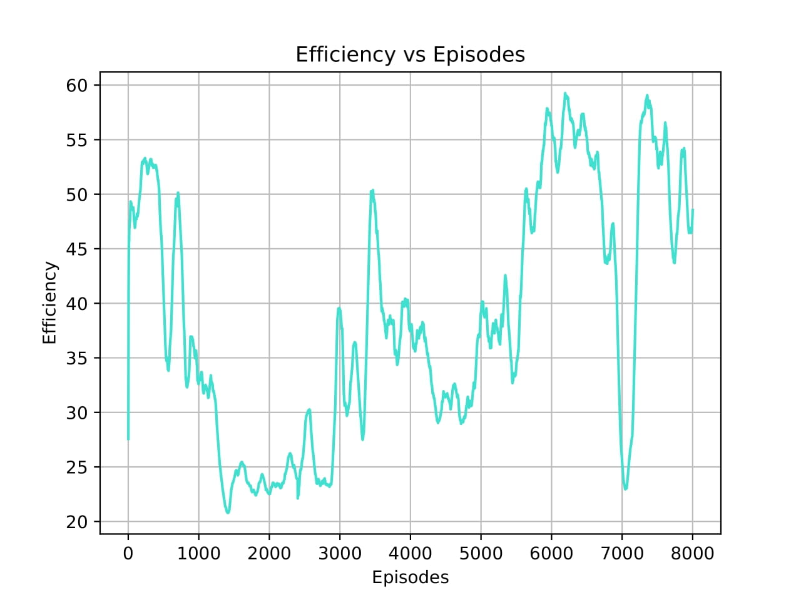
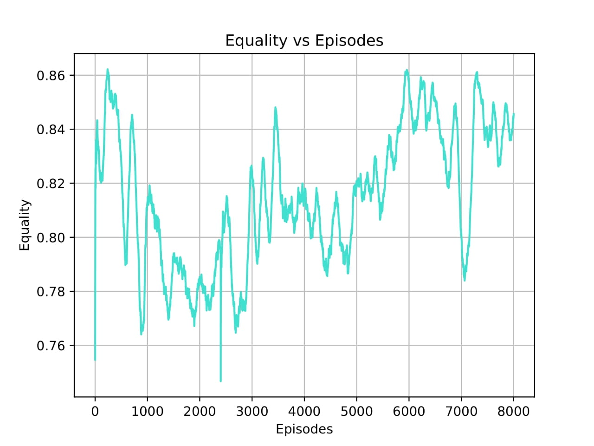
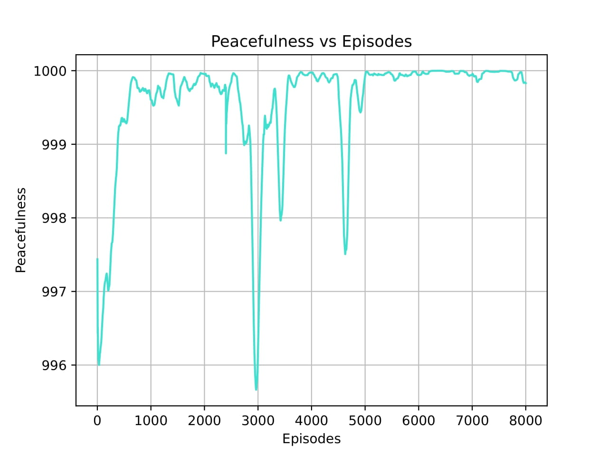

# Experiment logs

This repository holds the logs for all experiments executed in the Commons harvest environment.  

Whenever the word parolat is used, it refers that the experiment either uses the map or the probabilities 
proposed in the work 
[A multi-agent reinforcement learning model of common-pool resource appropriation](https://duckduckgo.com). While 
meltingpot refers to the map or the probabilities proposed in the meltingpot paper 
[Melting Pot: an evaluation suite for multi-agent reinforcement learning](https://www.deepmind.com/publications/melting-pot-an-evaluation-suite-for-multi-agent-reinforcement-learning)

## A3C workers experiments - shared weights

These experiments aim to assess the influence of the number of workers in the performance
of the A3C algorithm. All Agents share same weights and were trained in the _parolat_ map using _meltingpot_ 
probabilities.  
### Time

### Efficiency 

### Equality 

### Peacefulness 

## PPO shared weights

### MAP: Parolat PROB: Meltingpot

[Policy Video](https://www.youtube.com/watch?v=CmxYK4wG608)

### Efficiency 

### Equality 

### Peacefulness 

### MAP: Meltingpot PROB: Meltingpot

[Policy Video](https://www.youtube.com/watch?v=k18gqW0_Klk)

### Efficiency 

### Equality 

### Peacefulness 
